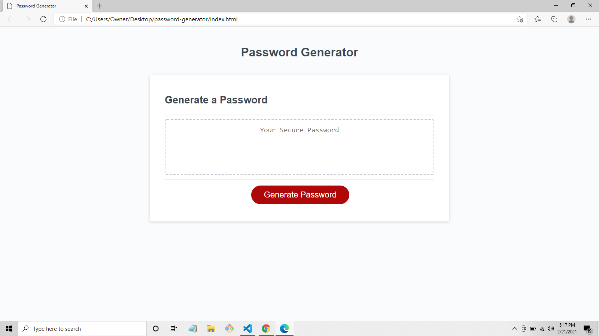

# Password Generator

This is an application that will created a specialized password, allowing the user to choose what characters they want in their password.  The user is given the option to include certain characters: uppercase letters, lowercase letters, numbers, and/or special characters.  The users password can include 8-128 characters.

This assignment was my first project writing Javascript code. To create this application, I used functions and a for loop.  I used if statements as well as logical and and logical or statements. I added instructions to the code on how to handle incorrect input. For instance, if the user chose an invalid number of characters or wrote in letters instead of a number.  I also wrote code on how the program to respond if the user did not choose any specifications for their password.

[Password Generator](https://fdwootton.github.io/password-generator/)

